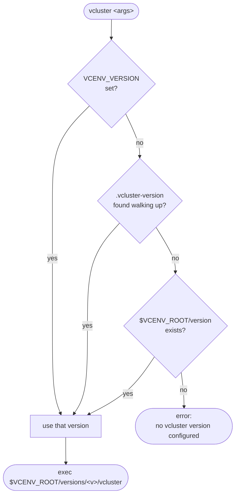

# Installation and configuration

This guide covers supported platforms, installation methods, required setup steps, how `vc-env` discovers configuration, and common troubleshooting.

## Supported platforms

Prebuilt binaries are currently produced for:

- `darwin/amd64`
- `darwin/arm64`
- `linux/amd64`
- `linux/arm64`

If your platform is not listed, install from source.

## Prerequisites

- A POSIX-like shell (e.g. `bash` or `zsh`).
- Permission to create and write files in your chosen `VCENV_ROOT` directory.
- Network access to GitHub:
    - `vc-env install`, `vc-env latest`, and `vc-env list-remote` fetch information from GitHub.

No existing `vcluster` installation is required; `vc-env` manages the `vcluster` binaries it installs.

## Install methods

=== "Prebuilt binary (recommended)"

    1. Download the binary for your platform from the project's
       [GitHub releases](https://github.com/mmpyro/vc-env/releases).
    2. Make it executable and move it into a directory on your `PATH`.

    Example (Linux x86_64):

    ```sh
    curl -L -o vc-env https://github.com/mmpyro/vc-env/releases/download/v1.0.0/vc-env-linux-amd64
    chmod +x vc-env
    sudo mv vc-env /usr/local/bin/vc-env
    ```

=== "Build from source"

    ```sh
    git clone https://github.com/mmpyro/vc-env.git
    cd vc-env
    make build
    ```

    The binary will be available at `build/vc-env`.

=== "Cross-compile for all platforms"

    ```sh
    make build-all
    ```

    This produces `build/vc-env-<os>-<arch>` for `linux/amd64`,
    `linux/arm64`, `darwin/amd64` and `darwin/arm64`.

## Initial setup

### 1) Choose and export `VCENV_ROOT`

`VCENV_ROOT` is required. It defines where `vc-env` stores installed versions, the shim, and the global version file.

Add this to your shell profile (e.g. `~/.bashrc` or `~/.zshrc`):

```sh
export VCENV_ROOT="$HOME/.vcenv"
```

Required permissions:

- `vc-env init` creates directories under `$VCENV_ROOT`.
- `vc-env install` writes `vcluster` binaries under `$VCENV_ROOT/versions/<version>/vcluster`.
- `vc-env global` writes `$VCENV_ROOT/version`.

### 2) Initialize shell integration

Add this after the `VCENV_ROOT` export to your shell profile
(e.g. `~/.bashrc` or `~/.zshrc`):

```sh
eval "$(vc-env init)"
```

What this does:

- Prepends `$VCENV_ROOT/shims` to your `PATH` so `vcluster` resolves to the shim.
- Defines a `vc-env` shell function that enables `vc-env shell` to affect the current shell environment.

!!! note "Why `eval` and not just a `source`"
    `vc-env init` prints shell code to stdout. The `eval` applies it to
    the current shell, which is what makes `vc-env shell <version>`
    able to export `VCENV_VERSION` for your interactive session.

### 3) Install a `vcluster` version

```sh
vc-env install 0.21.1
```

Or install the latest stable version:

```sh
vc-env install
```

### 4) Configure which version to use

Pick one of:

=== "Global default"

    Applies everywhere unless overridden.

    ```sh
    vc-env global 0.21.1
    ```

=== "Per-directory"

    Creates a `.vcluster-version` file in the current directory.

    ```sh
    vc-env local 0.21.1
    ```

=== "Per-shell session"

    Sets `VCENV_VERSION`; requires `eval "$(vc-env init)"`.

    ```sh
    vc-env shell 0.21.1
    ```

## How configuration is discovered/loaded

When the `vcluster` shim runs, it selects a version using this priority order:

1. `VCENV_VERSION` (shell version)
2. `.vcluster-version` in the current directory or any parent directory (local version)
3. `$VCENV_ROOT/version` (global version)



Notes:

- The `.vcluster-version` lookup walks upward until the filesystem root.
- All version values are treated as strings and trimmed for whitespace.
- A value may be an alias (`latest`, `latest-stable`, `latest-prerelease`,
  `MAJOR.MINOR`, `~MAJOR.MINOR.PATCH`) which the shim re-resolves on every
  call. See the [CLI reference "Version aliases" section](cli-reference.md#version-aliases).

## Auto-install for teammates

Set `VCENV_AUTO_INSTALL=1` in your shell profile to have the `vcluster` shim
install any missing version on demand (via `vc-env ensure`). This is the
smoothest onboarding experience when a repository ships a
`.vcluster-version` file.

```sh
export VCENV_AUTO_INSTALL=1
```

Without this variable, the shim still resolves aliases to installed concrete
versions when possible, and otherwise prints a helpful error that tells you
how to install the missing version or enable auto-install.

## Air-gapped installs

If GitHub is not reachable, download the vcluster binary ahead of time and
install it from the local path. Supply the checksum you obtained
out-of-band so vc-env verifies integrity:

```sh
vc-env install 0.21.1 \
  --from-file ./vcluster-linux-amd64 \
  --sha256 <hex-digest>
```

`--from-file` always requires a concrete `<version>` argument and never
touches the network. If `--sha256` is omitted, vc-env proceeds but prints a
warning that integrity was not verified.

## Common troubleshooting

### `VCENV_ROOT not set`

!!! warning "Symptom"
    `vc-env init` prints instructions and exits with an error.

!!! tip "Fix"
    Export `VCENV_ROOT` and wire the shim into your current shell:

    ```sh
    export VCENV_ROOT="$HOME/.vcenv"
    eval "$(vc-env init)"
    ```

    Then add both lines to your `~/.bashrc` or `~/.zshrc` so they survive new shells.

### `vc-env: no vcluster version configured`

!!! warning "Symptom"
    The `vcluster` shim fails because none of the three version sources is set.

!!! tip "Fix"
    Pick the scope you want and set a version with the matching command:

    ```sh
    vc-env global 0.21.1   # machine-wide default
    vc-env local  0.21.1   # per-directory (.vcluster-version)
    vc-env shell  0.21.1   # per-shell (VCENV_VERSION)
    ```

### `version <X> not installed`

!!! warning "Symptom"
    `vc-env` validates that a version is installed before setting it via `global`, `local`, or `shell`, and the shim also verifies the installed binary is present.

!!! tip "Fix"
    Install the version first, then set it:

    ```sh
    vc-env install <X>
    vc-env global  <X>
    ```

### GitHub API rate limit exceeded

!!! warning "Symptom"
    Some commands query GitHub releases. If GitHub returns `403`, `vc-env` reports a rate limit error.

!!! tip "Fix"
    Export a GitHub token so requests use the authenticated 5000/h quota
    instead of the anonymous 60/h/IP one:

    ```sh
    export VCENV_GITHUB_TOKEN="<personal access token>"
    # or, in CI, rely on the runner-injected GITHUB_TOKEN
    ```

    `VCENV_GITHUB_TOKEN` takes precedence over `GITHUB_TOKEN`. See the
    [environment variables](cli-reference.md#environment-variables)
    section for the full list.
