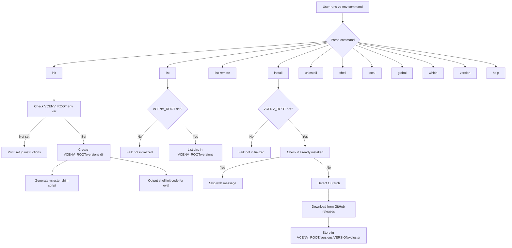
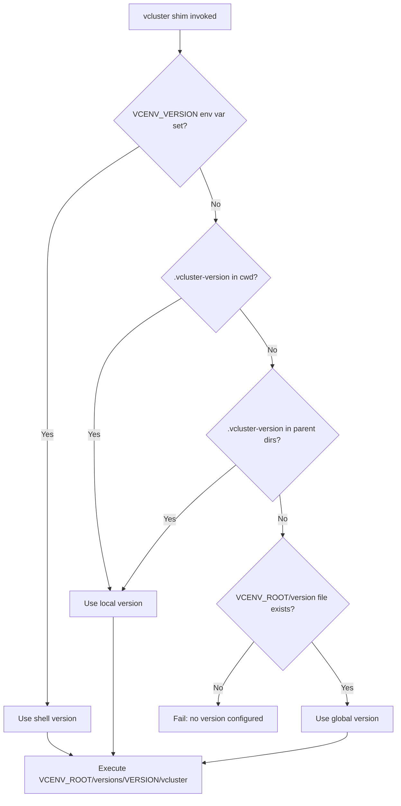
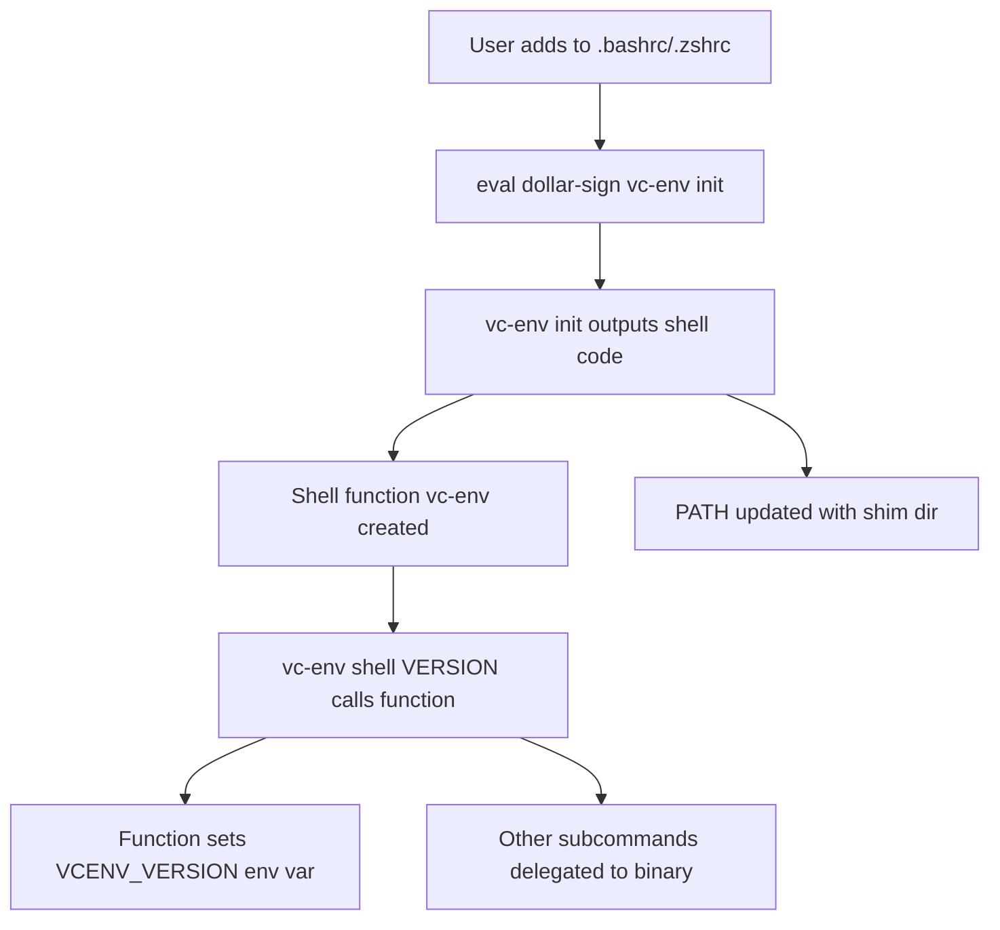

# vc-env Implementation Plan

## Language: Go

## Project Structure

```
vc-env/
├── cmd/
│   └── vc-env/
│       └── main.go                 # Entry point, command routing
├── internal/
│   ├── commands/
│   │   ├── init.go                 # init command
│   │   ├── init_test.go
│   │   ├── list.go                 # list command
│   │   ├── list_test.go
│   │   ├── listremote.go           # list-remote command
│   │   ├── listremote_test.go
│   │   ├── install.go              # install command
│   │   ├── install_test.go
│   │   ├── uninstall.go            # uninstall command
│   │   ├── uninstall_test.go
│   │   ├── shell.go                # shell command
│   │   ├── shell_test.go
│   │   ├── local.go                # local command
│   │   ├── local_test.go
│   │   ├── global.go               # global command
│   │   ├── global_test.go
│   │   ├── which.go                # which command
│   │   ├── which_test.go
│   │   ├── version.go              # version command
│   │   ├── version_test.go
│   │   └── help.go                 # help command
│   ├── config/
│   │   ├── config.go               # VCENV_ROOT, version resolution logic
│   │   └── config_test.go
│   ├── github/
│   │   ├── client.go               # GitHub API client for releases
│   │   └── client_test.go
│   ├── platform/
│   │   ├── detect.go               # OS/arch detection
│   │   └── detect_test.go
│   └── shim/
│       ├── shim.go                 # Shim and shell function generation
│       └── shim_test.go
├── scripts/
│   └── test-docker.sh              # Docker-based integration test script
├── Dockerfile.test                 # Ubuntu-based test container
├── Makefile                        # Build, test, cross-compile targets
├── go.mod
├── go.sum
├── LICENSE
├── README.md
└── Requirements.md
```

## Architecture



## Version Resolution Flow



## Shell Integration Flow



## Implementation Details

### Phase 1: Project Setup and Core Infrastructure

#### 1.1 Initialize Go module
- `go mod init github.com/user/vc-env`
- Set Go version to 1.22+
- No external dependencies — use only stdlib

#### 1.2 Main entry point and command routing
- [`cmd/vc-env/main.go`](cmd/vc-env/main.go) — parse `os.Args`, route to command handlers
- Simple switch/case on first argument for subcommand dispatch
- Exit with appropriate codes on errors

#### 1.3 Config module
- [`internal/config/config.go`](internal/config/config.go)
- `GetVCEnvRoot()` — reads `VCENV_ROOT` env var
- `IsInitialized()` — checks if `VCENV_ROOT` is set and `versions` dir exists
- `RequireInit()` — guard function that fails with message if not initialized
- `ResolveVersion()` — implements the version priority logic:
  1. Check `VCENV_VERSION` env var
  2. Walk up directories looking for `.vcluster-version`
  3. Check `$VCENV_ROOT/version` file
- `GetVersionDir(version)` — returns `$VCENV_ROOT/versions/{version}`
- `GetBinaryPath(version)` — returns `$VCENV_ROOT/versions/{version}/vcluster`

### Phase 2: Commands Implementation

#### 2.1 `help` command
- Print formatted list of all commands with descriptions
- Also shown when no command is provided or invalid command given

#### 2.2 `version` command
- Print hardcoded version string, set via `ldflags` at build time
- `go build -ldflags "-X main.Version=0.1.0"`

#### 2.3 `init` command
- Check if `VCENV_ROOT` is set
  - If not: print instructions for setting it in `.bashrc`/`.zshrc`
  - If set: create `$VCENV_ROOT/versions/` directory, create shim script
- Output shell initialization code to stdout for `eval` pattern
- Shell init code includes:
  - A shell function `vc-env` that intercepts `shell` subcommand to set/unset `VCENV_VERSION`
  - PATH prepend for `$VCENV_ROOT/shims`

#### 2.4 `list` command
- Require init guard
- Read directory entries from `$VCENV_ROOT/versions/`
- Print each version name, one per line, sorted

#### 2.5 `list-remote` command
- Does NOT require init — only queries GitHub
- Call GitHub API: `GET https://api.github.com/repos/loft-sh/vcluster/releases`
- Handle pagination — follow `Link` header for all pages
- Filter: exclude pre-releases by default
- With `--prerelease` flag: include pre-releases
- Strip `v` prefix from tag names
- Print versions sorted

#### 2.6 `install` command
- Require init guard
- Accept version as argument; if no argument, fetch latest from GitHub API
- Check if version already installed — skip with message if so
- Detect OS via `runtime.GOOS` and arch via `runtime.GOARCH`
- Map to vcluster release asset naming convention
- Download binary from GitHub releases
- Store at `$VCENV_ROOT/versions/{version}/vcluster`
- Set executable permission `chmod +x`

#### 2.7 `uninstall` command
- Require init guard
- Require version argument — fail if not provided
- Check version exists in `$VCENV_ROOT/versions/` — fail if not
- Remove `$VCENV_ROOT/versions/{version}/` directory
- Print confirmation message

#### 2.8 `shell` command
- Require init guard
- With version argument:
  - Verify version is installed — fail if not
  - Output `export VCENV_VERSION={version}` for the shell function wrapper to eval
- Without argument:
  - Read `VCENV_VERSION` env var
  - If set: print it
  - If not set: print error message, exit non-zero

#### 2.9 `local` command
- Require init guard
- With version argument:
  - Verify version is installed — fail if not
  - Write version to `.vcluster-version` in current directory
- Without argument:
  - Walk up from cwd looking for `.vcluster-version`
  - If found: print its contents
  - If not found: print error message, exit non-zero

#### 2.10 `global` command
- Require init guard
- With version argument:
  - Verify version is installed — fail if not
  - Write version to `$VCENV_ROOT/version`
- Without argument:
  - Read `$VCENV_ROOT/version`
  - If exists: print its contents
  - If not exists: print error message, exit non-zero

#### 2.11 `which` command
- Require init guard
- Resolve version using priority logic from config
- Print absolute path: `$VCENV_ROOT/versions/{version}/vcluster`
- Fail if no version is configured

### Phase 3: Shim and Shell Integration

#### 3.1 Vcluster shim script
- Generated by `init` at `$VCENV_ROOT/shims/vcluster`
- Shell script that:
  1. Resolves version using priority logic
  2. Executes the correct binary, passing through all arguments
- Alternative: the shim could call `vc-env which` and exec the result

#### 3.2 Shell function
- Generated by `vc-env init` output
- Wraps `vc-env` command so that `vc-env shell VERSION` can set `VCENV_VERSION` in the current shell
- For bash/zsh:
  ```sh
  vc-env() {
    if [ "$1" = "shell" ]; then
      if [ -n "$2" ]; then
        # Validate via the real binary first
        command vc-env shell "$2" || return $?
        export VCENV_VERSION="$2"
      else
        command vc-env shell
      fi
    else
      command vc-env "$@"
    fi
  }
  ```

### Phase 4: Platform Detection and Download

#### 4.1 Platform detection
- [`internal/platform/detect.go`](internal/platform/detect.go)
- Map `runtime.GOOS`: `linux`, `darwin`
- Map `runtime.GOARCH`: `amd64`, `arm64`
- Construct download URL based on vcluster release naming convention

#### 4.2 GitHub API client
- [`internal/github/client.go`](internal/github/client.go)
- `ListReleases(includePrerelease bool)` — paginated fetch of all releases
- `GetLatestRelease()` — fetch latest stable release
- `GetDownloadURL(version, os, arch)` — construct asset download URL
- Handle rate limiting gracefully with informative error messages

### Phase 5: Testing

#### 5.1 Unit tests
- Each command module has corresponding `_test.go` file
- Use temporary directories for `VCENV_ROOT` in tests
- Mock HTTP responses for GitHub API tests using `httptest.NewServer`
- Test version resolution logic with various combinations
- Test error cases: not initialized, version not installed, etc.

#### 5.2 Docker integration tests
- `Dockerfile.test` based on Ubuntu
- `scripts/test-docker.sh` — builds vc-env, runs container, executes all commands
- Test flow:
  1. Set `VCENV_ROOT`
  2. Run `vc-env init`
  3. Run `vc-env list-remote`
  4. Run `vc-env install {version}`
  5. Run `vc-env list`
  6. Run `vc-env global {version}`
  7. Run `vc-env which`
  8. Run `vc-env local {version}`
  9. Run `vc-env shell {version}`
  10. Run `vc-env uninstall {version}`
  11. Run `vc-env version`
  12. Run `vc-env help`
  13. Verify shim works: run `vcluster version`

### Phase 6: Build and Distribution

#### 6.1 Makefile
- `make build` — build for current platform
- `make build-all` — cross-compile for linux/amd64, linux/arm64, darwin/amd64, darwin/arm64
- `make test` — run unit tests
- `make test-docker` — run Docker integration tests
- `make clean` — remove build artifacts
- Version injected via `-ldflags`

#### 6.2 README.md
- Installation instructions
- Quick start guide
- Command reference
- Shell setup instructions
